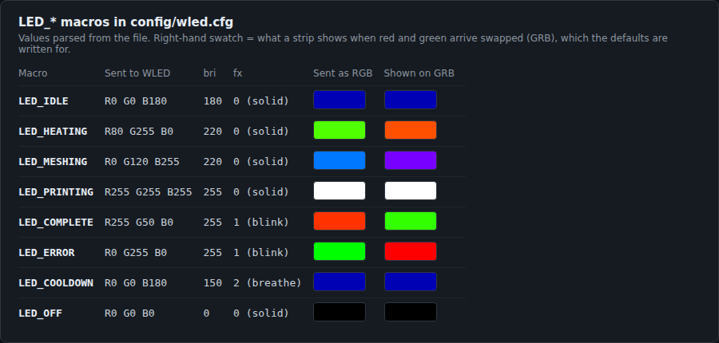
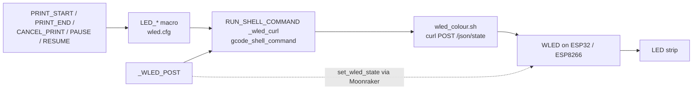

# WLED Voron F1 Lights

Klipper macros that set a WLED LED strip on a Voron 2 (or any Klipper printer) to an F1-themed colour for each print state: idle, heating, meshing, printing, complete, error and cooldown.



[](LICENSE)


Based on [Gliptopolis/WLED_Klipper](https://github.com/Gliptopolis/WLED_Klipper), reworked on a Voron 2.

## What it does

- Adds `LED_IDLE`, `LED_HEATING`, `LED_MESHING`, `LED_PRINTING`, `LED_COMPLETE`, `LED_ERROR`, `LED_COOLDOWN` and `LED_OFF` macros to Klipper.
- Each macro posts one JSON request straight to WLED's `/json/state` API (colour, brightness, effect) through a small shell script, so the change is immediate and doesn't depend on Moonraker's WLED presets.
- Uses three WLED effects: solid, blink (complete and error) and breathe (cooldown).
- Clears a frozen WLED segment on every call (`"frz": false`), so a segment left frozen from the WLED UI doesn't swallow the colour.
- Ships an optional `print_macros.cfg` with `PRINT_START`, `PRINT_END`, `CANCEL_PRINT`, `PAUSE` and `RESUME` that already call the LED macros.

## Screenshots


Generated on 2026-10-08 by parsing the `LED_*` macros in `config/wled.cfg` and drawing each value. It is not a photo of a strip. The left swatch is the RGB value as sent; the right one is what a strip shows when red and green arrive swapped, which is what the defaults are written for (see [Status and limits](#status-limits-and-real-results)).

| State | Macro | Intended colour | Effect |
|---|---|---|---|
| Idle | `LED_IDLE` | Deep blue, "parked in the garage" | Solid |
| Heating | `LED_HEATING` | Orange, "engine warming up" | Solid |
| Meshing | `LED_MESHING` | Electric blue, "systems check" | Solid |
| Printing | `LED_PRINTING` | Bright white, "race lights on" | Solid |
| Complete | `LED_COMPLETE` | Green, "chequered flag" | Blink |
| Error | `LED_ERROR` | Red, "safety car" | Blink |
| Cooldown | `LED_COOLDOWN` | Blue, "cool-down lap" | Breathe |
| Off | `LED_OFF` | Off | |

## Quick start

You need a Klipper printer with Moonraker and Mainsail or Fluidd, and an ESP32 or ESP8266 running [WLED](https://install.wled.me/) on your network, wired to a WS2812B, SK6812 or COB strip. COB strips aren't individually addressable, but full-strip colour and brightness work.

1. **Flash WLED** from [install.wled.me](https://install.wled.me/) and note the ESP's IP address. Check the colour order at `http://<WLED-IP>/settings/leds` (most WS2812B and COB strips are GRB).
2. **Install `gcode_shell_command`** (Klipper doesn't ship it):

   ```bash
   wget -O ~/klipper/klippy/extras/gcode_shell_command.py \
     https://raw.githubusercontent.com/Rat-OS/RatOS/master/src/modules/ratos/filesystem/home/pi/klipper/klippy/extras/gcode_shell_command.py
   ```

3. **Copy the files** onto the printer's Pi:

   ```bash
   git clone https://github.com/casareanderson/WLED_Voron--F1-Lights
   cd WLED_Voron--F1-Lights
   mkdir -p ~/klipper_config/scripts
   cp scripts/wled_colour.sh ~/klipper_config/scripts/
   chmod +x ~/klipper_config/scripts/wled_colour.sh
   cp config/wled.cfg ~/printer_data/config/
   ```

4. **Point `wled.cfg` at your strip.** Every `PARAMS=` line uses the placeholder address `192.0.2.50`; replace it with your WLED controller's IP (here `192.168.1.50`):

   ```bash
   sed -i -E 's/PARAMS="[0-9.]+ /PARAMS="192.168.1.50 /' ~/printer_data/config/wled.cfg
   grep -c 'PARAMS="192.168.1.50 ' ~/printer_data/config/wled.cfg    # expect 9
   ```

   If your user isn't `pi`, also fix the script path in `[gcode_shell_command _wled_curl]`.
5. **Add the WLED strip to `moonraker.conf`** (used by `_WLED_POST`, and gives you the strip in the Mainsail UI):

   ```ini
   [wled klipper]
   type: http
   address: 192.0.2.50
   initial_red: 0.0
   initial_green: 0.0
   initial_blue: 0.71
   chain_count: 330
   ```

6. **Include it** in `printer.cfg`, then restart:

   ```ini
   [include wled.cfg]
   ```

   ```bash
   sudo systemctl restart klipper moonraker
   ```

7. **Test** from the Mainsail or Fluidd console. Success is the strip changing on each one:

   ```
   LED_IDLE
   LED_HEATING
   LED_MESHING
   LED_PRINTING
   LED_COMPLETE
   LED_ERROR
   LED_COOLDOWN
   ```

## Usage

If you already have a working `PRINT_START` and `PRINT_END`, **don't replace them**. Add the LED calls at the right points:

```ini
[gcode_macro PRINT_START]
gcode:
    LED_HEATING           # before bed and nozzle heating
    M190 S{BED_TEMP}
    M109 S{EXTRUDER_TEMP}

    LED_MESHING           # before Z_TILT / QGL and bed mesh
    Z_TILT_ADJUST
    BED_MESH_CALIBRATE

    LED_HEATING           # before a final nozzle heat, if you heat after meshing
    M109 S{EXTRUDER_TEMP}

    LED_PRINTING          # just before the purge line or first move

[gcode_macro PRINT_END]
gcode:
    # ... your existing end moves ...
    LED_COMPLETE          # after heaters off and park
    G4 P8000              # hold for 8 seconds
    LED_COOLDOWN

[gcode_macro CANCEL_PRINT]
gcode:
    LED_ERROR             # at the top, so it flashes immediately
    # ... your existing cancel moves ...

[gcode_macro PAUSE]
gcode:
    # ... your existing pause moves ...
    LED_HEATING           # amber = attention needed

[gcode_macro RESUME]
gcode:
    LED_PRINTING          # back to white
    # ... your existing resume moves ...
```

Or include `config/print_macros.cfg`, which has all five with the LED calls in place. It is written for the author's Voron: it waits on a `temperature_sensor cartographer_coil` (a Cartographer probe) and optionally a `temperature_sensor chamber_temp`, uses `Z_TILT_ADJUST` and adaptive meshing, and renames the stock `CANCEL_PRINT`, `PAUSE` and `RESUME`. Check each line against your printer before you include it.

## Configuration

**Colour values.** Each macro calls the shell script with six values:

```
<WLED-IP>  R  G  B  BRIGHTNESS  EFFECT
```

`BRIGHTNESS` is 0–255. `EFFECT` is a WLED effect id: `0` solid, `1` blink, `2` breathe. Change the numbers in `wled.cfg` to change a colour.

| Setting | Where | Default | What it does |
|---|---|---|---|
| WLED address | every `PARAMS=` line in `wled.cfg` | the author's LAN address | Where the colour is posted. Must be changed. |
| Script path | `[gcode_shell_command _wled_curl]` | `/home/pi/klipper_config/scripts/wled_colour.sh` | The script Klipper runs |
| `timeout` | `[gcode_shell_command _wled_curl]` | `5` s | Klipper gives up on the script after this |
| `--connect-timeout`, `--max-time` | `wled_colour.sh` | `3` s, `5` s | curl limits, so an unreachable strip doesn't hang a print |
| `[wled klipper]` | `moonraker.conf` | 330 LEDs, initial blue 0.71 | Moonraker's own handle on the strip |
| `R`, `G`, `B`, `BRI`, `FX` | `_WLED_POST` parameters | 0, 0, 0, 255, 0 | Optional generic macro: sets Moonraker's strip on at `BRI`, then posts the colour |

## How it works



`wled_colour.sh` sends a single request:

```json
{"on": true, "bri": BRI, "seg": [{"id": 0, "frz": false, "fx": FX, "col": [[R, G, B]]}]}
```

to `http://<WLED-IP>/json/state`, with curl's output discarded. Segment 0 only.

```
WLED_Voron--F1-Lights/
├── config/
│   ├── wled.cfg            LED_* macros, _WLED_POST and the shell-command definition
│   └── print_macros.cfg    optional PRINT_START/END, CANCEL_PRINT, PAUSE, RESUME with LEDs
├── scripts/
│   └── wled_colour.sh      posts one colour to WLED's JSON API
└── docs/colours.png        swatches generated from wled.cfg
```

## Status, limits and real results

- Built on the author's Voron 2. There is no automated test and no measured result in this repo; the swatch image is drawn from the config, not photographed.
- **The defaults are written for a strip where red and green arrive swapped.** `LED_HEATING` sends `80 255 0` to get orange, `LED_COMPLETE` sends `255 50 0` to get green, and `LED_ERROR` sends `0 255 0` to get red. If WLED's colour order is set to match your strip, those come out swapped (green heating, red complete, green error); swap R and G back in those lines.
- **`LED_MESHING` is not pre-swapped.** It sends `0 120 255`, which shows as electric blue on a strip with the right colour order, but as violet (`120 0 255`) on a swapped one, as the swatch shows. Send `120 0 255` if your strip swaps and you want blue.
- The WLED IP address is hard-coded in nine places in `wled.cfg`; there is no single variable for it.
- Only WLED segment 0 is set.
- `LED_*` macros don't go through Moonraker, so Moonraker's view of the strip can be out of date after one runs.

### Troubleshooting

- **Strip not responding:** `curl -s http://<WLED-IP>/json/state` and look for `"frz": true`. If WLED's AudioReactive usermod is on, disable it at `http://<WLED-IP>/settings/um`.
- **Wrong colours:** check the colour order at `http://<WLED-IP>/settings/leds`, then see the colour notes above.
- **Unknown command `LED_IDLE`:** confirm `[include wled.cfg]` is in `printer.cfg`, then `tail -f ~/printer_data/logs/klippy.log`.
- **`RUN_SHELL_COMMAND` unknown:** check `ls ~/klipper/klippy/extras/gcode_shell_command.py` and restart Klipper.

## Licence and credits

MIT, see [LICENSE](LICENSE).

- Original idea: [Gliptopolis/WLED_Klipper](https://github.com/Gliptopolis/WLED_Klipper)
- WLED firmware: [Aircoookie/WLED](https://github.com/Aircoookie/WLED)
- `gcode_shell_command.py`: from [RatOS](https://github.com/Rat-OS/RatOS), originally by Arksine (GPLv3), downloaded separately and not included here

If this is useful to you, [buy me a coffee](https://buymeacoffee.com/iamc_tech) ☕
